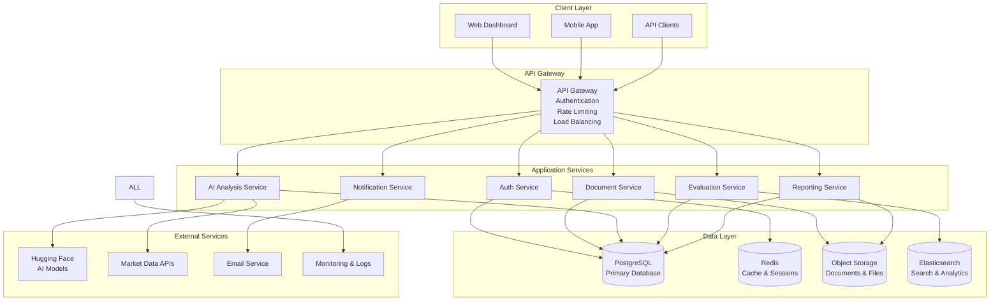

# AI Investment Evaluation System - Technical Architecture

> **Comprehensive technical architecture and system design documentation**

## 📋 Document Information

- **Version**: 1.0
- **Last Updated**: [Insert Date]
- **Status**: Draft
- **Architecture Review**: Pending

## 🏗️ System Overview

### Architecture Principles

1. **Microservices Architecture**: Modular, scalable, and maintainable services
2. **API-First Design**: RESTful APIs with comprehensive documentation
3. **Cloud-Native**: Designed for cloud deployment with auto-scaling
4. **Security by Design**: Security integrated at every architectural layer
5. **Event-Driven**: Asynchronous processing for performance and reliability
6. **Data-Driven**: Analytics and monitoring built into the foundation

### High-Level Architecture



---

## 🎯 Technology Stack

### Backend Technologies

#### Core Framework
```python
# Primary Framework
FastAPI 0.104+          # High-performance async web framework
Python 3.11+            # Latest stable Python version
Pydantic 2.0+           # Data validation and serialization
SQLAlchemy 2.0+         # Modern async ORM
Alembic                 # Database migrations
```

#### Database & Storage
```python
# Primary Database
PostgreSQL 15+          # ACID-compliant relational database
asyncpg                 # Async PostgreSQL driver

# Caching & Sessions
Redis 7+                # In-memory cache and session store
redis-py                # Python Redis client

# Object Storage
AWS S3 / MinIO          # Document and file storage
boto3                   # AWS SDK for Python

# Search & Analytics
Elasticsearch 8+        # Full-text search and analytics
elasticsearch-py        # Python Elasticsearch client
```

#### AI/ML Stack
```python
# Natural Language Processing
transformers 4.35+      # Hugging Face transformers
torch 2.0+              # PyTorch for deep learning
spacy 3.7+              # Industrial NLP library
sentence-transformers   # Semantic similarity models

# Machine Learning
scikit-learn 1.3+       # Traditional ML algorithms
pandas 2.1+             # Data manipulation and analysis
numpy 1.24+             # Numerical computing
scipy 1.11+             # Scientific computing

# Document Processing
PyMuPDF (fitz)          # PDF text extraction
python-pptx             # PowerPoint processing
openpyxl                # Excel file processing
python-docx             # Word document processing
Pillow (PIL)            # Image processing
```

#### API & Integration
```python
# Web Framework
uvicorn                 # ASGI server
gunicorn                # WSGI server for production
httpx                   # Async HTTP client
websockets              # WebSocket support

# Authentication & Security
python-jose[cryptography] # JWT token handling
passlib[bcrypt]         # Password hashing
python-multipart        # Form data handling
cryptography            # Encryption utilities

# Background Tasks
celery                  # Distributed task queue
redis                   # Message broker for Celery
flower                  # Celery monitoring
```

### Frontend Technologies

#### Core Framework
```javascript
// Primary Framework
React 18+               // Modern React with concurrent features
TypeScript 5+           // Type-safe JavaScript
Vite 4+                 // Fast build tool and dev server
React Router 6+         // Client-side routing

// State Management
Zustand                 // Lightweight state management
React Query (TanStack)  // Server state management
React Hook Form         // Form handling and validation
```

#### UI Components & Styling
```javascript
// Component Library
Material-UI (MUI) 5+    // Comprehensive React components
@mui/x-data-grid        // Advanced data grid component
@mui/x-date-pickers     // Date/time picker components

// Styling
@emotion/react          // CSS-in-JS styling
@emotion/styled         // Styled components
@mui/material/styles    // MUI theming system

// Icons & Assets
@mui/icons-material     // Material Design icons
@heroicons/react        // Additional icon set
```

#### Data Visualization
```javascript
// Charting Libraries
Chart.js 4+             // Flexible charting library
react-chartjs-2         // React wrapper for Chart.js
recharts                // Composable charting library
d3                      // Advanced data visualization

// PDF & Document Handling
react-pdf               // PDF viewer component
jspdf                   // PDF generation
html2canvas             // Screenshot generation
```

#### Development Tools
```javascript
// Code Quality
ESLint 8+               // JavaScript linting
Prettier 3+             // Code formatting
@typescript-eslint      // TypeScript-specific linting
husky                   // Git hooks

// Testing
Vitest                  // Fast unit testing framework
@testing-library/react  // React component testing
@testing-library/jest-dom // Custom Jest matchers
Playwright              // End-to-end testing

// Build & Deployment
Vite                    // Build tool and bundler
@vitejs/plugin-react    // React plugin for Vite
vite-plugin-pwa         // Progressive Web App features
```

### Infrastructure & DevOps

#### Containerization
```dockerfile
# Docker Configuration
Docker 24+              # Containerization platform
Docker Compose 2+       # Multi-container orchestration
Multi-stage builds      # Optimized container images
Health checks           # Container health monitoring
```

#### Cloud Services (AWS)
```yaml
# Compute Services
ECS Fargate             # Serverless container hosting
Application Load Balancer # Load balancing and SSL termination
Auto Scaling Groups     # Automatic scaling based on demand

# Storage Services
RDS PostgreSQL          # Managed database service
ElastiCache Redis       # Managed Redis service
S3                      # Object storage for documents
EFS                     # Shared file system (if needed)

# Security & Networking
VPC                     # Virtual private cloud
Security Groups         # Network-level security
IAM Roles & Policies    # Access management
Secrets Manager         # Secure credential storage
Certificate Manager     # SSL/TLS certificates

# Monitoring & Logging
CloudWatch              # Metrics and logging
X-Ray                   # Distributed tracing
CloudTrail              # API call auditing
```

#### CI/CD Pipeline
```yaml
# GitHub Actions Workflow
name: CI/CD Pipeline
on: [push, pull_request]

jobs:
  test:
    - Code quality checks (ESLint, Prettier, Black)
    - Unit tests with coverage reporting
    - Integration tests
    - Security vulnerability scanning
    
  build:
    - Docker image building
    - Multi-architecture support
    - Image vulnerability scanning
    - Registry push (ECR)
    
  deploy:
    - Infrastructure as Code (Terraform)
    - Blue-green deployment
    - Database migrations
    - Health checks and rollback
```

---

## 🏛️ System Architecture

### 1. API Gateway Layer

#### Purpose
Central entry point for all client requests, handling authentication, rate limiting, and request routing.

#### Components
```python
# API Gateway Configuration
from fastapi import FastAPI, Depends, HTTPException
from fastapi.middleware.cors import CORSMiddleware
from fastapi.middleware.trustedhost import TrustedHostMiddleware
from slowapi import Limiter, _rate_limit_exceeded_handler
from slowapi.util import get_remote_address

app = FastAPI(
    title="AI Investment Evaluation API",
    version="1.0.0",
    docs_url="/docs",
    redoc_url="/redoc"
)

# Security Middleware
app.add_middleware(
    CORSMiddleware,
    allow_origins=["https://yourdomain.com"],
    allow_credentials=True,
    allow_methods=["GET", "POST", "PUT", "DELETE"],
    allow_headers=["*"],
)

app.add_middleware(
    TrustedHostMiddleware,
    allowed_hosts=["yourdomain.com", "*.yourdomain.com"]
)

# Rate Limiting
limiter = Limiter(key_func=get_remote_address)
app.state.limiter = limiter
app.add_exception_handler(429, _rate_limit_exceeded_handler)
```

#### Features
- **Authentication**: JWT token validation and refresh
- **Authorization**: Role-based access control (RBAC)
- **Rate Limiting**: Per-user and per-endpoint rate limits
- **Request Validation**: Input sanitization and validation
- **Response Caching**: Intelligent caching for performance
- **Logging**: Comprehensive request/response logging

### 2. Authentication Service

#### Architecture
```python
# Authentication Service Structure
auth_service/
├── models/
│   ├── user.py              # User data models
│   ├── organization.py      # Organization models
│   └── permissions.py       # Permission models
├── services/
│   ├── auth_service.py      # Core authentication logic
│   ├── jwt_service.py       # JWT token management
│   └── password_service.py  # Password hashing/validation
├── routers/
│   ├── auth.py              # Authentication endpoints
│   ├── users.py             # User management endpoints
│   └── organizations.py     # Organization endpoints
└── dependencies/
    ├── auth_deps.py         # Authentication dependencies
    └── rbac_deps.py         # Role-based access control
```

#### Security Features
```python
# JWT Configuration
JWT_SETTINGS = {
    "algorithm": "RS256",           # RSA signature algorithm
    "access_token_expire": 3600,    # 1 hour access token
    "refresh_token_expire": 604800, # 7 days refresh token
    "issuer": "ai-investment-eval", # Token issuer
    "audience": "api-users"         # Token audience
}

# Password Security
PASSWORD_CONFIG = {
    "min_length": 12,
    "require_uppercase": True,
    "require_lowercase": True,
    "require_digits": True,
    "require_symbols": True,
    "hash_algorithm": "bcrypt",
    "rounds": 12
}

# Multi-Factor Authentication
MFA_CONFIG = {
    "enabled": True,
    "methods": ["totp", "sms", "email"],
    "backup_codes": True,
    "grace_period": 86400  # 24 hours
}
```

### 3. Document Processing Service

#### Architecture
```python
# Document Service Structure
document_service/
├── models/
│   ├── document.py          # Document metadata models
│   ├── processing.py        # Processing status models
│   └── extraction.py        # Extracted content models
├── processors/
│   ├── pdf_processor.py     # PDF processing logic
│   ├── ppt_processor.py     # PowerPoint processing
│   ├── excel_processor.py   # Excel processing
│   ├── word_processor.py    # Word processing
│   └── image_processor.py   # Image/OCR processing
├── services/
│   ├── upload_service.py    # File upload handling
│   ├── validation_service.py # File validation
│   ├── extraction_service.py # Content extraction
│   └── storage_service.py   # File storage management
└── tasks/
    ├── processing_tasks.py  # Async processing tasks
    └── cleanup_tasks.py     # File cleanup tasks
```

#### Processing Pipeline
```python
# Document Processing Workflow
class DocumentProcessor:
    async def process_document(self, document_id: str) -> ProcessingResult:
        # 1. File Validation
        await self.validate_file(document_id)
        
        # 2. Virus Scanning
        await self.scan_for_viruses(document_id)
        
        # 3. Content Extraction
        content = await self.extract_content(document_id)
        
        # 4. Structure Analysis
        structure = await self.analyze_structure(content)
        
        # 5. Entity Recognition
        entities = await self.extract_entities(content)
        
        # 6. Quality Assessment
        quality = await self.assess_quality(content, entities)
        
        # 7. Store Results
        return await self.store_results(document_id, {
            "content": content,
            "structure": structure,
            "entities": entities,
            "quality": quality
        })
```

#### File Processing Capabilities
```python
# Supported File Formats
SUPPORTED_FORMATS = {
    "pdf": {
        "extensions": [".pdf"],
        "max_size": "50MB",
        "processor": "PyMuPDF",
        "features": ["text", "tables", "images", "metadata"]
    },
    "powerpoint": {
        "extensions": [".ppt", ".pptx"],
        "max_size": "100MB",
        "processor": "python-pptx",
        "features": ["slides", "text", "images", "charts"]
    },
    "excel": {
        "extensions": [".xls", ".xlsx"],
        "max_size": "25MB",
        "processor": "openpyxl",
        "features": ["sheets", "formulas", "charts", "data"]
    },
    "word": {
        "extensions": [".doc", ".docx"],
        "max_size": "25MB",
        "processor": "python-docx",
        "features": ["paragraphs", "tables", "images", "styles"]
    }
}
```

### 4. AI Analysis Service

#### Architecture
```python
# AI Service Structure
ai_service/
├── models/
│   ├── analysis.py          # Analysis result models
│   ├── predictions.py       # Prediction models
│   └── confidence.py        # Confidence scoring models
├── processors/
│   ├── nlp_processor.py     # NLP processing pipeline
│   ├── financial_analyzer.py # Financial analysis
│   ├── market_analyzer.py   # Market analysis
│   ├── team_analyzer.py     # Team evaluation
│   └── risk_analyzer.py     # Risk assessment
├── ml_models/
│   ├── transformers/        # Hugging Face models
│   ├── classifiers/         # Custom ML models
│   ├── embeddings/          # Embedding models
│   └── ensembles/           # Ensemble methods
├── services/
│   ├── model_service.py     # Model management
│   ├── inference_service.py # Prediction service
│   ├── training_service.py  # Model training
│   └── evaluation_service.py # Model evaluation
└── tasks/
    ├── analysis_tasks.py    # Async analysis tasks
    ├── training_tasks.py    # Model training tasks
    └── batch_tasks.py       # Batch processing
```

#### NLP Pipeline
```python
# Natural Language Processing Pipeline
class NLPPipeline:
    def __init__(self):
        self.tokenizer = AutoTokenizer.from_pretrained("finbert-base")
        self.model = AutoModel.from_pretrained("finbert-base")
        self.spacy_nlp = spacy.load("en_core_web_lg")
        
    async def analyze_text(self, text: str) -> NLPResult:
        # 1. Text Preprocessing
        cleaned_text = await self.preprocess_text(text)
        
        # 2. Entity Recognition
        entities = await self.extract_entities(cleaned_text)
        
        # 3. Sentiment Analysis
        sentiment = await self.analyze_sentiment(cleaned_text)
        
        # 4. Topic Classification
        topics = await self.classify_topics(cleaned_text)
        
        # 5. Risk Factor Identification
        risks = await self.identify_risks(cleaned_text)
        
        # 6. Financial Metric Extraction
        metrics = await self.extract_financial_metrics(cleaned_text)
        
        return NLPResult(
            entities=entities,
            sentiment=sentiment,
            topics=topics,
            risks=risks,
            metrics=metrics,
            confidence=self.calculate_confidence()
        )
```

#### Scoring Algorithms
```python
# Multi-Dimensional Scoring System
class InvestmentScorer:
    def __init__(self):
        self.financial_model = load_model("financial_health_v1.pkl")
        self.market_model = load_model("market_opportunity_v1.pkl")
        self.team_model = load_model("team_strength_v1.pkl")
        self.risk_model = load_model("risk_assessment_v1.pkl")
    
    async def calculate_scores(self, analysis_data: dict) -> ScoreResult:
        # Financial Health Score (0-100)
        financial_score = await self.calculate_financial_score(
            analysis_data["financial_metrics"]
        )
        
        # Market Opportunity Score (0-100)
        market_score = await self.calculate_market_score(
            analysis_data["market_data"]
        )
        
        # Team Strength Score (0-100)
        team_score = await self.calculate_team_score(
            analysis_data["team_info"]
        )
        
        # Risk Assessment (0-100, lower is better)
        risk_score = await self.calculate_risk_score(
            analysis_data["risk_factors"]
        )
        
        # Overall Investment Score with confidence intervals
        overall_score, confidence_interval = await self.calculate_overall_score(
            financial_score, market_score, team_score, risk_score
        )
        
        return ScoreResult(
            financial_health=financial_score,
            market_opportunity=market_score,
            team_strength=team_score,
            risk_assessment=risk_score,
            overall_score=overall_score,
            confidence_interval=confidence_interval,
            recommendation=self.generate_recommendation(overall_score)
        )
```

### 5. Database Architecture

#### PostgreSQL Schema
```sql
-- Core Tables Schema

-- Users and Authentication
CREATE TABLE users (
    id UUID PRIMARY KEY DEFAULT gen_random_uuid(),
    email VARCHAR(255) UNIQUE NOT NULL,
    password_hash VARCHAR(255) NOT NULL,
    first_name VARCHAR(100) NOT NULL,
    last_name VARCHAR(100) NOT NULL,
    is_active BOOLEAN DEFAULT true,
    is_verified BOOLEAN DEFAULT false,
    mfa_enabled BOOLEAN DEFAULT false,
    created_at TIMESTAMP WITH TIME ZONE DEFAULT NOW(),
    updated_at TIMESTAMP WITH TIME ZONE DEFAULT NOW()
);

-- Organizations
CREATE TABLE organizations (
    id UUID PRIMARY KEY DEFAULT gen_random_uuid(),
    name VARCHAR(255) NOT NULL,
    slug VARCHAR(100) UNIQUE NOT NULL,
    subscription_tier VARCHAR(50) DEFAULT 'freemium',
    subscription_status VARCHAR(50) DEFAULT 'active',
    settings JSONB DEFAULT '{}',
    created_at TIMESTAMP WITH TIME ZONE DEFAULT NOW(),
    updated_at TIMESTAMP WITH TIME ZONE DEFAULT NOW()
);

-- User-Organization Relationships
CREATE TABLE user_organizations (
    id UUID PRIMARY KEY DEFAULT gen_random_uuid(),
    user_id UUID REFERENCES users(id) ON DELETE CASCADE,
    organization_id UUID REFERENCES organizations(id) ON DELETE CASCADE,
    role VARCHAR(50) NOT NULL DEFAULT 'member',
    permissions JSONB DEFAULT '[]',
    joined_at TIMESTAMP WITH TIME ZONE DEFAULT NOW(),
    UNIQUE(user_id, organization_id)
);

-- Ventures (Investment Opportunities)
CREATE TABLE ventures (
    id UUID PRIMARY KEY DEFAULT gen_random_uuid(),
    organization_id UUID REFERENCES organizations(id) ON DELETE CASCADE,
    name VARCHAR(255) NOT NULL,
    industry VARCHAR(100),
    stage VARCHAR(50),
    funding_round VARCHAR(50),
    location VARCHAR(255),
    website VARCHAR(255),
    description TEXT,
    metadata JSONB DEFAULT '{}',
    created_at TIMESTAMP WITH TIME ZONE DEFAULT NOW(),
    updated_at TIMESTAMP WITH TIME ZONE DEFAULT NOW()
);

-- Documents
CREATE TABLE documents (
    id UUID PRIMARY KEY DEFAULT gen_random_uuid(),
    venture_id UUID REFERENCES ventures(id) ON DELETE CASCADE,
    filename VARCHAR(255) NOT NULL,
    original_filename VARCHAR(255) NOT NULL,
    file_type VARCHAR(50) NOT NULL,
    file_size BIGINT NOT NULL,
    storage_path VARCHAR(500) NOT NULL,
    processing_status VARCHAR(50) DEFAULT 'pending',
    processing_started_at TIMESTAMP WITH TIME ZONE,
    processing_completed_at TIMESTAMP WITH TIME ZONE,
    extracted_content JSONB,
    metadata JSONB DEFAULT '{}',
    created_at TIMESTAMP WITH TIME ZONE DEFAULT NOW(),
    updated_at TIMESTAMP WITH TIME ZONE DEFAULT NOW()
);

-- Evaluations
CREATE TABLE evaluations (
    id UUID PRIMARY KEY DEFAULT gen_random_uuid(),
    venture_id UUID REFERENCES ventures(id) ON DELETE CASCADE,
    created_by UUID REFERENCES users(id),
    status VARCHAR(50) DEFAULT 'in_progress',
    financial_score DECIMAL(5,2),
    market_score DECIMAL(5,2),
    team_score DECIMAL(5,2),
    risk_score DECIMAL(5,2),
    overall_score DECIMAL(5,2),
    confidence_interval JSONB,
    recommendation VARCHAR(50),
    analysis_data JSONB,
    insights JSONB,
    created_at TIMESTAMP WITH TIME ZONE DEFAULT NOW(),
    updated_at TIMESTAMP WITH TIME ZONE DEFAULT NOW()
);

-- Expert Overrides
CREATE TABLE evaluation_overrides (
    id UUID PRIMARY KEY DEFAULT gen_random_uuid(),
    evaluation_id UUID REFERENCES evaluations(id) ON DELETE CASCADE,
    user_id UUID REFERENCES users(id),
    field_name VARCHAR(100) NOT NULL,
    original_value DECIMAL(5,2),
    override_value DECIMAL(5,2) NOT NULL,
    justification TEXT NOT NULL,
    approved_by UUID REFERENCES users(id),
    approved_at TIMESTAMP WITH TIME ZONE,
    created_at TIMESTAMP WITH TIME ZONE DEFAULT NOW()
);

-- Feedback and Learning
CREATE TABLE evaluation_feedback (
    id UUID PRIMARY KEY DEFAULT gen_random_uuid(),
    evaluation_id UUID REFERENCES evaluations(id) ON DELETE CASCADE,
    user_id UUID REFERENCES users(id),
    feedback_type VARCHAR(50) NOT NULL,
    rating INTEGER CHECK (rating >= 1 AND rating <= 5),
    comments TEXT,
    outcome_data JSONB,
    created_at TIMESTAMP WITH TIME ZONE DEFAULT NOW()
);

-- Audit Trail
CREATE TABLE audit_logs (
    id UUID PRIMARY KEY DEFAULT gen_random_uuid(),
    user_id UUID REFERENCES users(id),
    organization_id UUID REFERENCES organizations(id),
    action VARCHAR(100) NOT NULL,
    resource_type VARCHAR(50) NOT NULL,
    resource_id UUID NOT NULL,
    old_values JSONB,
    new_values JSONB,
    ip_address INET,
    user_agent TEXT,
    created_at TIMESTAMP WITH TIME ZONE DEFAULT NOW()
);
```

#### Indexing Strategy
```sql
-- Performance Indexes
CREATE INDEX idx_users_email ON users(email);
CREATE INDEX idx_users_organization ON user_organizations(organization_id, user_id);
CREATE INDEX idx_ventures_org ON ventures(organization_id);
CREATE INDEX idx_documents_venture ON documents(venture_id);
CREATE INDEX idx_documents_status ON documents(processing_status);
CREATE INDEX idx_evaluations_venture ON evaluations(venture_id);
CREATE INDEX idx_evaluations_created_by ON evaluations(created_by);
CREATE INDEX idx_evaluations_status ON evaluations(status);
CREATE INDEX idx_audit_logs_user ON audit_logs(user_id);
CREATE INDEX idx_audit_logs_resource ON audit_logs(resource_type, resource_id);

-- Composite Indexes
CREATE INDEX idx_evaluations_org_status ON evaluations(venture_id, status, created_at DESC);
CREATE INDEX idx_documents_venture_type ON documents(venture_id, file_type);

-- Full-text Search Indexes
CREATE INDEX idx_ventures_search ON ventures USING gin(to_tsvector('english', name || ' ' || COALESCE(description, '')));
CREATE INDEX idx_documents_content_search ON documents USING gin((extracted_content::text));
```

### 6. Caching Strategy

#### Redis Configuration
```python
# Redis Cache Configuration
REDIS_CONFIG = {
    "host": "localhost",
    "port": 6379,
    "db": 0,
    "decode_responses": True,
    "max_connections": 100,
    "retry_on_timeout": True,
    "socket_keepalive": True,
    "socket_keepalive_options": {},
}

# Cache Patterns
CACHE_PATTERNS = {
    # User Sessions (30 minutes)
    "session:{user_id}": {"ttl": 1800, "type": "hash"},
    
    # API Rate Limiting (1 hour)
    "rate_limit:{user_id}:{endpoint}": {"ttl": 3600, "type": "counter"},
    
    # Document Processing Status (24 hours)
    "processing:{document_id}": {"ttl": 86400, "type": "string"},
    
    # Evaluation Results (7 days)
    "evaluation:{evaluation_id}": {"ttl": 604800, "type": "json"},
    
    # User Preferences (24 hours)
    "user_prefs:{user_id}": {"ttl": 86400, "type": "hash"},
    
    # Organization Settings (1 hour)
    "org_settings:{org_id}": {"ttl": 3600, "type": "json"},
}
```

---

## 🔒 Security Architecture

### Authentication & Authorization

#### JWT Token Strategy
```python
# JWT Configuration
JWT_CONFIG = {
    "algorithm": "RS256",
    "access_token_expire_minutes": 60,
    "refresh_token_expire_days": 7,
    "issuer": "ai-investment-evaluation",
    "audience": "api-users",
    "private_key_path": "/secrets/jwt_private_key.pem",
    "public_key_path": "/secrets/jwt_public_key.pem"
}

# Token Structure
ACCESS_TOKEN_PAYLOAD = {
    "sub": "user_id",           # Subject (user ID)
    "org": "organization_id",   # Organization ID
    "role": "user_role",        # User role in organization
    "permissions": ["perm1"],   # Specific permissions
    "iat": "issued_at",         # Issued at timestamp
    "exp": "expires_at",        # Expiration timestamp
    "iss": "issuer",            # Token issuer
    "aud": "audience"           # Token audience
}
```

#### Role-Based Access Control (RBAC)
```python
# Permission System
PERMISSIONS = {
    # Document Management
    "documents.upload": "Upload documents",
    "documents.view": "View documents",
    "documents.delete": "Delete documents",
    
    # Evaluation Management
    "evaluations.create": "Create evaluations",
    "evaluations.view": "View evaluations",
    "evaluations.edit": "Edit evaluations",
    "evaluations.delete": "Delete evaluations",
    "evaluations.override": "Override AI scores",
    
    # Reporting
    "reports.generate": "Generate reports",
    "reports.export": "Export data",
    
    # Administration
    "users.manage": "Manage users",
    "organization.settings": "Manage organization settings",
    "billing.manage": "Manage billing"
}

# Role Definitions
ROLES = {
    "viewer": {
        "permissions": [
            "documents.view",
            "evaluations.view",
            "reports.generate"
        ]
    },
    "analyst": {
        "permissions": [
            "documents.upload",
            "documents.view",
            "evaluations.create",
            "evaluations.view",
            "evaluations.edit",
            "reports.generate",
            "reports.export"
        ]
    },
    "partner": {
        "permissions": [
            "documents.upload",
            "documents.view",
            "documents.delete",
            "evaluations.create",
            "evaluations.view",
            "evaluations.edit",
            "evaluations.delete",
            "evaluations.override",
            "reports.generate",
            "reports.export"
        ]
    },
    "admin": {
        "permissions": [
            "*"  # All permissions
        ]
    }
}
```

---

## 📊 Monitoring & Observability

### Application Monitoring
```python
# Prometheus Metrics Configuration
from prometheus_client import Counter, Histogram, Gauge

# Request Metrics
REQUEST_COUNT = Counter(
    'http_requests_total',
    'Total HTTP requests',
    ['method', 'endpoint', 'status']
)

REQUEST_DURATION = Histogram(
    'http_request_duration_seconds',
    'HTTP request duration',
    ['method', 'endpoint']
)

# Business Metrics
DOCUMENT_PROCESSING_TIME = Histogram(
    'document_processing_seconds',
    'Document processing time',
    ['file_type']
)

EVALUATION_ACCURACY = Gauge(
    'evaluation_accuracy_score',
    'Current evaluation accuracy score'
)

ACTIVE_USERS = Gauge(
    'active_users_total',
    'Number of active users'
)
```

### Logging Configuration
```python
# Structured Logging Setup
import structlog

structlog.configure(
    processors=[
        structlog.stdlib.filter_by_level,
        structlog.stdlib.add_logger_name,
        structlog.stdlib.add_log_level,
        structlog.stdlib.PositionalArgumentsFormatter(),
        structlog.processors.TimeStamper(fmt="iso"),
        structlog.processors.StackInfoRenderer(),
        structlog.processors.format_exc_info,
        structlog.processors.UnicodeDecoder(),
        structlog.processors.JSONRenderer()
    ],
    context_class=dict,
    logger_factory=structlog.stdlib.LoggerFactory(),
    wrapper_class=structlog.stdlib.BoundLogger,
    cache_logger_on_first_use=True,
)

# Usage Example
logger = structlog.get_logger()
logger.info(
    "Document processed",
    document_id="123e4567-e89b-12d3-a456-426614174000",
    processing_time=45.2,
    file_type="pdf",
    success=True
)
```

---

## 🚀 Deployment Architecture

### Container Configuration
```dockerfile
# Multi-stage Dockerfile for Backend
FROM python:3.11-slim as builder

WORKDIR /app
COPY requirements.txt .
RUN pip install --no-cache-dir -r requirements.txt

FROM python:3.11-slim as runtime

WORKDIR /app
COPY --from=builder /usr/local/lib/python3.11/site-packages /usr/local/lib/python3.11/site-packages
COPY . .

EXPOSE 8000
HEALTHCHECK --interval=30s --timeout=30s --start-period=5s --retries=3 \
  CMD curl -f http://localhost:8000/health || exit 1

CMD ["uvicorn", "app.main:app", "--host", "0.0.0.0", "--port", "8000"]
```

### Infrastructure as Code
```hcl
# Terraform Configuration for AWS
resource "aws_ecs_cluster" "main" {
  name = "ai-investment-eval"
  
  setting {
    name  = "containerInsights"
    value = "enabled"
  }
}

resource "aws_ecs_service" "api" {
  name            = "api-service"
  cluster         = aws_ecs_cluster.main.id
  task_definition = aws_ecs_task_definition.api.arn
  desired_count   = 2
  
  load_balancer {
    target_group_arn = aws_lb_target_group.api.arn
    container_name   = "api"
    container_port   = 8000
  }
  
  depends_on = [aws_lb_listener.api]
}

resource "aws_rds_instance" "postgres" {
  identifier = "ai-investment-eval-db"
  
  engine         = "postgres"
  engine_version = "15.4"
  instance_class = "db.t3.micro"
  
  allocated_storage     = 20
  max_allocated_storage = 100
  storage_encrypted     = true
  
  db_name  = "investment_eval"
  username = "postgres"
  password = var.db_password
  
  backup_retention_period = 7
  backup_window          = "03:00-04:00"
  maintenance_window     = "sun:04:00-sun:05:00"
  
  skip_final_snapshot = false
  final_snapshot_identifier = "ai-investment-eval-final-snapshot"
}
```

---

**Document Status**: Draft
**Next Review**: [Insert Date]
**Architecture Review**: [Insert Reviewer]
**Version Control**: Managed in Git repository
